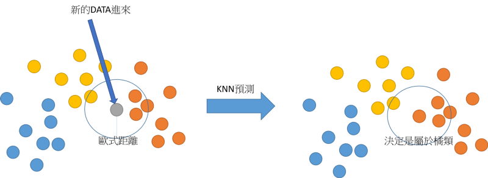

### Coding起來- 程式開發不可忽略的語言- Markdown 教學


Github連結

Yo~ 今天我來介紹對於一個程式設計師非常重要的一項技能，相信也對很多常使用Github的人並不陌生，當我們每次點選Github專案，裡面都會有readme這個由markdown寫成的文件，也就是記載著這個程式專案的說明文件，那它的應用面相當廣，也有公司會直接把它當成是快速編寫網頁的方法，不只程式設計師適合學習撰寫mardown，所有人都很適合藉由markdown來撰寫一些文件喔

### Markdown 是什麼?


顧名思義，它屬於一種輕量型的標記語言，擁有純文字標記的特性，它在文字編寫上相較於HTML，寫法上比較簡潔，使它具有可讀性高的特性，它的應用面相當廣，像是大家熟悉的Github，它用來撰寫說明文件，FBMessenger、Slack(團隊合作上的通訊軟體)等，它用來發送訊息，而wordpress(架網站)，它可以用以撰寫一些網頁內容等

### Markdown 優缺點


**優點:**

- 可讀性高
- 比HTML寫起來簡潔
- 好理解，快速撰寫
- 支援HTML寫法

**缺點:**

- 功能較HTML少，有些方法還是需要使用HTML標籤(tag)來撰寫

### Markdown 小工具


前面兩個網站，一個可以幫助我們快速線上及時預覽撰寫Markdown的呈現結果，一個是可以幫助我們在HTML與Markdown間的轉換，後面那個軟體叫Typora，它是我用來撰寫Markdown檔案的軟體，它非常好用，也可以及時預覽Markdown呈現結果

- Markdown preview: https://markdownlivepreview.com/
- HTML <-> Markdown: https://domchristie.github.io/turndown/
- Typora: https://typora.io/


### Mardown 語法

#### 1. 標題語法

標題語法可以有atx、Setext和HTML格式的寫法

```
1. 第一種寫法: atx
# H1 tag Markdown
## H2 tag Markdown
### H3 tag Markdown
#### H4 tag Markdown
##### H5 tag Markdown
###### H6 tag Markdown

2. 第二種寫法: HTML格式
<h1>Markdown</h1>
<h2>Markdown</h2>
<h3>Markdown</h3>
<h4>Markdown</h4>
<h5>Markdown</h5>
<h6>Markdown</h6>

3. 第三種寫法: Setext
Markdown H1不同寫法
===============
Markdown H2不同寫法
------------------
```

#### 執行結果


#### 2. 強調語法與字體顏色

```
這邊強調 *斜體*
這邊強調 _斜體_

這邊強調 **粗體**
這邊強調 __粗體__

混搭使用 **粗體+斜體
混搭使用 _斜體+粗體**

<font color="blue" size = 74>74號藍色字體</font>
<font color="#00FFFF" size = 58>58號天藍色(色碼方式)字體</font>
<font color="#A52A2A" face = "微軟正黑" size=78>78號咖啡色微軟正黑字體</font>
```

#### 執行結果


#### 3. 列表

**小叮嚀:** 如果要在列表裡的項目，又有次列表，只要使用兩個空白即可，縮排要縮的一樣

```
1. 有序列表, 只要縮排就能在項目底下，新增一組清單

1. 第一個
2. 第二個
3. 第三個
  a. 第一個
  b. 第二個
  c. 第三個
  
2. 無序列表, 可以使用*、-、+ 都是可以的，可以單一用也可以混用

* 第一個 
- 第二個
+ 第三個
  * 第一個
  * 第二個
  * 第三個
  
3. HTML格式: 有序列表
<ol>
<li>第一個</li>
<li>第二個</li>
<li>第三個</li>
</ol>

4. HTML格式: 無序列表

<ul>
<li>第一個</li>
<li>第二個</li>
<li>第三個</li>
</ul>
```

#### 執行結果


### 4. 代辦清單(CheckBox)

**小叮嚀:** 可以自己手動點擊CheckBox 來勾選喔!!

```
- [x] 完成的項目一
- [ ] 未完成的項目二
- [ ] 試試自己手動勾選完成的項目三
```

#### 執行結果


### 5. 超連結

```
1. 文章內的超連結寫法 : 連接到外部路徑
[Google](https://www.google.com/) 
[Google](https://www.google.com/ "Google Website") 

2. 文章內的超連結寫法 : 連接到內部路徑
[這是對應自己的目錄位置的相對位置路徑](../doc/readme) 

3. 文章內的參考連結寫法，它可以將超連結存放在文章其他位置
[參考連結][CH Wang的網頁]
[參考連結][1]

[CH Wang的網頁]:https://medium.com/@chwang12341
[1]: https://medium.com/@chwang12341
[參考連結]: https://medium.com/@chwang12341
```

#### 執行結果


### 6. 插入圖片

```
1. 複製網路上的圖片連結


2. 目錄位置底下的圖片


3. 參考方式，可以在文章後面再補上圖片位置
![image][RFM model]
[RFM model]: https://miro.medium.com/max/572/1*k-JVeD4azGCVVOYoKnYROg.png

4. 修改圖片位置與大小


圖片來源: https://img.16pic.com/00/89/93/16pic_8993283_s.jpg
```

### 執行結果


[**RFM model**] https://miro.medium.com/max/572/1*k-JVeD4azGCVVOYoKnYROg.png


### 7. 引用區塊

```
> 引用文字第一層
> 引用文字第一層: 引用區塊可以分成許多層級

>> 引用文字第二層
   兩個第二層空一行會有不同效果，會被分開與上面第一層級的不同喔
   
>> 引用文字第二層

>>> 引用文字第三層

>>> 引用文字第四層
可以不斷新增引用層
```

#### 執行結果


### 8. 程式區塊

```
語法: 
​```語言
​```

舉例:
​```markdown
​```

​```python
​```

​```javascript
​```

```

#### 執行結果


### 9. 區塊

```
段落內某些文字使用區塊，使用``，把文字包進去
Hello, I am `Shane`, I am `25` years old
```

#### 執行結果

Hello, I am `Shane`, I am `25` years old

### 10. 分隔線

```
只要超過三個符號，就會呈現分隔線喔，下面的方式都行

--------------------
* * *
***
*****
- - -

```

#### 執行結果


### 11. 表格

a. 生成好表格後，可以直接點選表格，調整你要的格式，像是置中、左、右，擴充表格等

**小叮嚀:** 不一定一定要對齊

```
範例: 建立一個3X5的表格(table)

|Name     |Age     |Id |
|---------|:------:|--:|
|Jack     |28      |1  |
|Tom      |22      |2  |
|Jen      |26      |3  |
|Tina   |27      |4  |


```

#### 執行結果


### 12. 影片

a. 放入youtube影片步驟: 選定你要的youtube影片，按下右鍵點選複製嵌入程式碼，然後貼上就有囉!!

```
<iframe width="994" height="559" src="https://www.youtube.com/embed/tmRSGf0pQK4" frameborder="0" allow="accelerometer; autoplay; encrypted-media; gyroscope; picture-in-picture" allowfullscreen></iframe>
```

#### 執行結果

<iframe width="994" height="559" src="https://www.youtube.com/embed/tmRSGf0pQK4" frameborder="0" allow="accelerometer; autoplay; encrypted-media; gyroscope; picture-in-picture" allowfullscreen></iframe>

